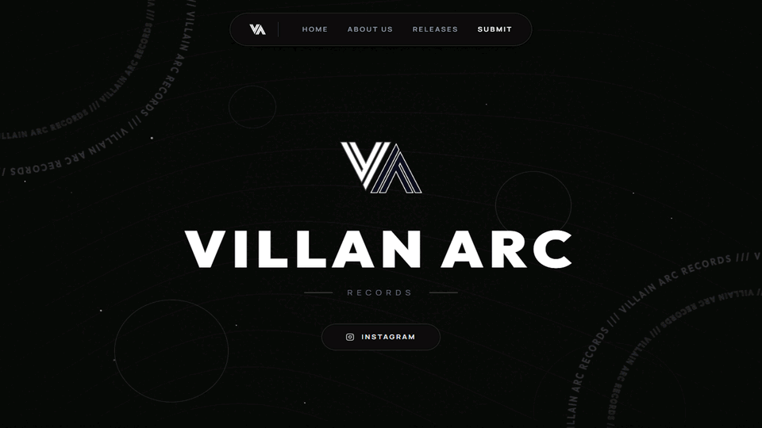

  
  <h1>Villain Arc Records</h1>
  
<strong>Underground Electronic & Dance Music Record Label</strong>

  
  

    
  

---

### 🌐 Live Website
🔗 **Official Web Experience:** [villainarcrecords.com](https://villainarcrecords.com/)

---

### 🎬 Website Experience & Motion Preview

  

---

### 📖 About Villain Arc Records
**Villain Arc Records** is an underground electronic and dance music record label championing raw intensity, dark cyberpunk aesthetics, and heavyweight club genres. The label curates a distinct sonic universe centered on **Hardstyle**, **Hardtekk**, **Industrial Techno**, and atmospheric electronic anthems.

#### Label Highlights:
- **Curated High-Energy Catalog**: Direct streaming showcase of signature releases and underground hardstyle/hardtekk reworks (including *"Shameless"*, *"Stereo Love"*, *"Bad Romance"*, *"Disturbia"*, *"Everytime We Touch"*, and *"Cure For Me"*).
- **Curated Spotify Vaults**: Master playlist ecosystems categorized by sonic energy—including curated Techno playlists, high-bpm Hardtekk vaults, and deep electronic selections.
- **Distinct Visual Identity**: A dystopian, cyberpunk visual design system built to mirror the dark, high-adrenaline music aesthetic.
- **Roster & Artist Hub**: Dedicated portal for artist showcases, social connections, and community engagement led by founder Maleny.

---

### 🛠️ Technology Stack & Engineering Architecture
Crafted for modern responsive performance and audio immersion:

- **Frontend Core**: [React 18](https://react.dev/) with [Vite](https://vitejs.dev/)
- **Styling**: Next-generation [Tailwind CSS v4](https://tailwindcss.com/)
- **Kinetic Motion**: [Framer Motion](https://www.framer.com/motion/) gesture and scroll-linked animation orchestration
- **Iconography**: Lucide Icons
- **Media & Streaming**: Spotify Web API Embeds and dynamic audio player components
- **Edge Security & Deployment**: Cloudflare Edge Infrastructure with active DDoS & bot protection

---

### 🔒 Repository & Source Notice
This repository serves as the **official public showcase and web portal** for Villain Arc Records.  
Proprietary distribution contracts, internal master audio archives, and private streaming analytics tools remain protected under private licensing.

---

### 👤 Author
Engineered by **[@INXRT](https://github.com/INXRT)**
